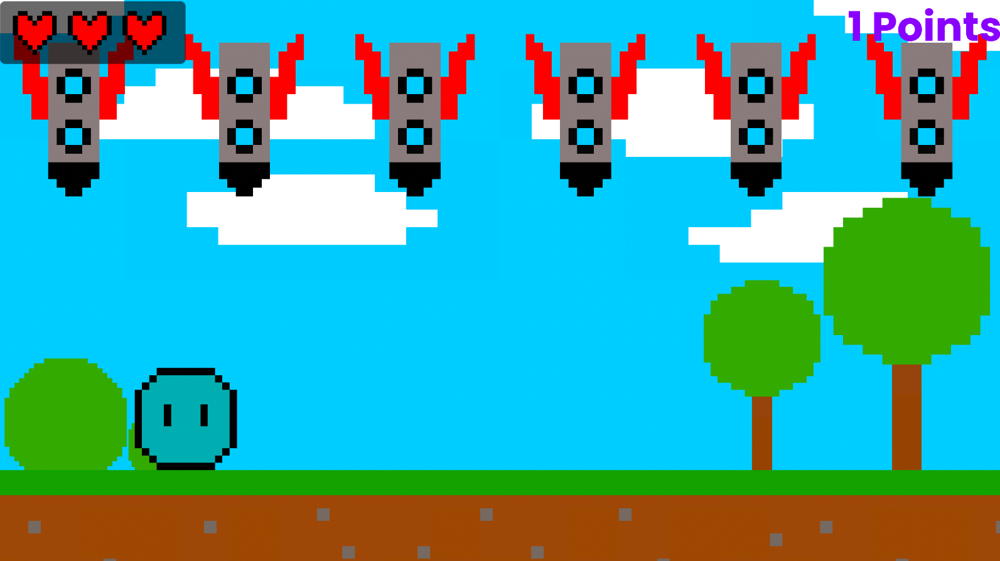

# Shoot a Rocket!

Mein erstes Spiel überhaupt in Unity. Die Assets sind alle selber gemacht. In dem Spiel geht es darum, von oben fallende Raketen abzuschießen. Das Spiel lässt sich auf zwei Schwierigkeitsstufen spielen: 
Easy, wo man sich frei bewegen darf
und Hard, wobei man von einem Rand des Bildschirms zum anderen wandert und keine Kontrolle darüber hat, wie man sich bewegt.

